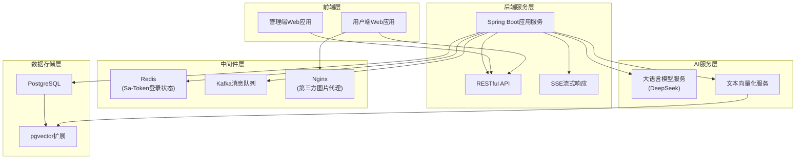
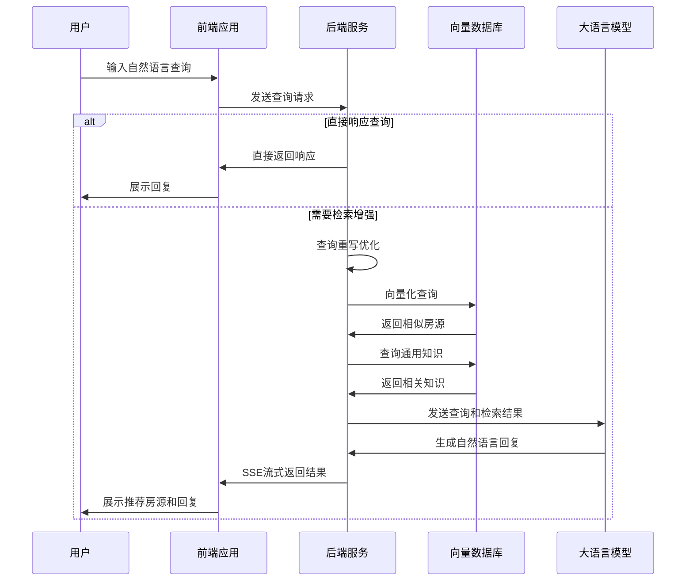

# EasyHome

## 项目介绍

EasyHome是一个基于LLM（大语言模型）和RAG（检索增强生成）技术的智能二手房推荐系统。该系统利用向量数据库存储房源信息，结合大语言模型的自然语言处理能力，为用户提供个性化的二手房推荐服务。

### 主要功能

- **智能对话推荐**：用户可以通过自然语言对话的方式描述需求，系统会智能分析并推荐匹配的房源
- **房源管理**：支持房源的发布、审核、编辑和下架
- **用户管理**：包括用户注册、登录、权限控制等功能
- **收藏与预约**：用户可以收藏感兴趣的房源，并在线预约看房
- **语义化搜索**：基于用户当前查询和对话历史，提供上下文相关的房源推荐
- **房源搜索**：支持多维度的房源筛选和搜索
- **通知系统**：预约确认、房源更新等通知推送

## 技术架构

### 技术栈

#### 后端
- **核心框架**：Spring Boot 3.4.7
- **ORM框架**：MyBatis-Plus 3.5.9
- **数据库**：PostgreSQL + pgvector（向量存储）
- **缓存**：Redis
- **消息队列**：Kafka
- **认证授权**：Sa-Token 1.42.0
- **AI集成**：Solon AI（用于LLM和Embedding模型集成）
- **文档存储**：阿里云OSS
- **API文档**：SpringDoc OpenAPI

#### 前端
- **核心框架**：Vue 3.5.13 + TypeScript
- **路由**：Vue Router 4.5.0
- **状态管理**：Pinia（仅用于管理端）
- **UI组件**：
  - 用户端：Tailwind CSS 4.1.10
  - 管理端：Element Plus 2.10.2
- **HTTP客户端**：Axios
- **构建工具**：Vite 6.2.4

### 系统架构

EasyHome采用前后端分离的微服务架构：

1. **前端层**：
   - 用户端Web应用（web目录）
   - 管理端Web应用（admin-web目录）
   - Nginx反向代理

2. **后端服务层**：
   - Spring Boot应用服务
   - RESTful API接口
   - WebSocket实时通信

3. **中间件层**：
   - Redis缓存
   - Kafka消息队列
   - 阿里云OSS对象存储

4. **数据存储层**：
   - PostgreSQL关系型数据库
   - pgvector向量扩展（存储Embedding向量）

5. **AI服务层**：
   - 大语言模型服务（如DeepSeek）
   - 文本向量化服务

#### 系统架构图



## 项目结构

```
EasyHome/
├── admin-web/                # 管理端前端项目
│   ├── public/               # 静态资源
│   ├── src/                  # 源代码
│   │   ├── router/           # 路由配置
│   │   ├── stores/           # Pinia状态管理
│   │   └── views/            # 页面组件
│   └── package.json          # 项目依赖
│
├── backend/                  # 后端项目
│   ├── src/
│   │   ├── main/
│   │   │   ├── java/com/coooolfan/easyhome/
│   │   │   │   ├── config/   # 配置类
│   │   │   │   ├── constant/ # 常量定义
│   │   │   │   ├── controller/ # 控制器
│   │   │   │   ├── exception/ # 异常处理
│   │   │   │   ├── handle/   # 全局处理器
│   │   │   │   ├── mapper/   # MyBatis映射接口
│   │   │   │   ├── message/  # 消息队列处理
│   │   │   │   ├── pojo/     # 数据对象
│   │   │   │   │   ├── dto/  # 数据传输对象
│   │   │   │   │   ├── entity/ # 实体类
│   │   │   │   │   └── vo/   # 视图对象
│   │   │   │   ├── response/ # 响应封装
│   │   │   │   ├── service/  # 服务接口和实现
│   │   │   │   └── utils/    # 工具类
│   │   │   └── resources/    # 配置文件
│   │   └── test/             # 测试代码
│   └── pom.xml               # Maven配置
│
├── web/                      # 用户端前端项目
│   ├── public/               # 静态资源
│   ├── src/                  # 源代码
│   │   ├── assets/           # 资源文件
│   │   ├── components/       # 公共组件
│   │   ├── router/           # 路由配置
│   │   └── views/            # 页面组件
│   └── package.json          # 项目依赖
│
├── sql/                      # SQL脚本
│   ├── init.sql              # 初始化脚本
│   └── dump.sql              # 数据备份
│
├── docker-compose.yml        # Docker编排配置
├── nginx.conf                # Nginx配置
└── README.md                 # 项目说明
```

## 关键功能实现

### RAG系统实现

EasyHome采用RAG（检索增强生成）技术为用户提供智能房源推荐服务。RAG系统的工作流程如下：

#### RAG流程图



#### 1. 数据向量化

- 房源信息向量化：系统将房源的标题、地址、价格、面积等信息转换为向量表示
- 知识库向量化：将房地产领域的常见知识转换为向量存储
- 向量存储：使用PostgreSQL的pgvector扩展存储和检索向量数据

```java
// 房源向量化示例
var embedding = embed.input(house.toString()).call()
        .getData().getFirst().getEmbedding();
embedding = EmbeddingUtils.cut(embedding);
houseVecMapper.insertHouseVec(house.getId(), Arrays.toString(embedding));
```

#### 2. 用户查询处理

- 查询理解：分析用户自然语言查询的语义
- 查询重写：根据对话历史和上下文优化查询
- 查询向量化：将用户查询转换为向量表示

```java
// 查询重写示例
StringBuilder ragPromptBuilder = getPromptBuilder(historyMessage);
String ragPrompt = String.format(LLMConstant.RAG_REWRITE, ragPromptBuilder, question.getContent());
val rewriteResp = rewriteModel.prompt(ragPrompt).call();
val regQuestion = rewriteResp.getAggregationMessage().getContent();
```

#### 3. 向量检索

- 相似度搜索：使用向量相似度搜索找到匹配的房源
- 多源检索：同时检索房源数据和通用知识库

```java
// 向量检索示例
var embedding = embed.input(query).call().getData().getFirst().getEmbedding();
embedding = EmbeddingUtils.cut(embedding);
List<Long> similarHouses = houseVecMapper.findSimilarHouses(Arrays.toString(embedding), limit);
return houseMapper.selectBatchIds(similarHouses);
```

#### 4. 结果生成

- 检索增强：将检索到的相关房源信息注入到LLM上下文
- 响应生成：LLM基于检索结果和用户查询生成自然语言响应
- 流式输出：使用SSE（Server-Sent Events）实现响应的流式传输

```java
// 结果生成示例
chatHistory.add(new UserMessage(
        houseService.getHousesDescByVectorSearch(chatHistory, new UserMessage(message.getMessage()), 5) + "\n"
                + commonKnowledgeVecService.getCommonKnowledgeDescByVectorSearch(chatHistory, new UserMessage(message.getMessage()), 5) + "\n"
                + message.getMessage()));
```

### 消息队列实现

系统使用Kafka消息队列处理异步任务，主要包括：

- 房源信息处理：新房源发布后的向量化和索引构建
- 预约通知：处理预约请求并发送通知

### 用户认证与授权

使用Sa-Token框架实现用户认证和权限控制：

- 基于角色的访问控制（RBAC）
- JWT令牌认证
- 接口权限管理

## 部署与启动指南

### 环境要求

- JDK 21+
- Node.js 18+
- Docker & Docker Compose
- PostgreSQL 17 (with pgvector extension)
- Redis 7+
- Kafka 7.5+

### 配置步骤

#### 1. 克隆代码库

```bash
git clone https://github.com/yourusername/EasyHome.git
cd EasyHome
```

#### 2. 配置环境变量

创建后端配置文件：

```bash
cp backend/src/main/resources/application-dev.template backend/src/main/resources/application-dev.yml
```

编辑 `application-dev.yml` 文件，配置以下内容：

- 数据库连接信息
- Redis连接信息
- Kafka连接信息
- LLM API密钥和端点
- 阿里云OSS配置

#### 3. 初始化数据库

```bash
# 启动数据库和中间件服务
docker-compose up -d

# 执行SQL初始化脚本
psql -U easyhome -d easyhome -h localhost -f sql/init.sql
```

### 启动项目

#### 启动后端服务

```bash
cd backend
./mvnw spring-boot:run
```

#### 启动用户前端

```bash
cd web
yarn install
yarn dev
```

#### 启动管理前端

```bash
cd admin-web
yarn install
yarn dev
```

### 访问应用

- 用户端: http://localhost:5173
- 管理端: http://localhost:5174
- API文档: http://localhost:8080/doc.html
